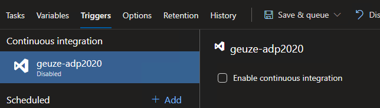
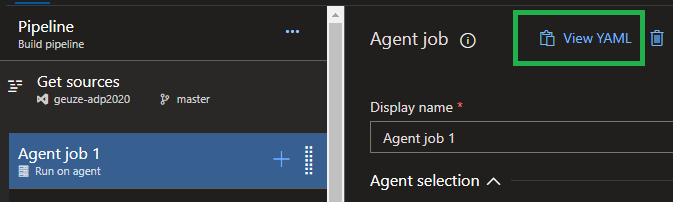

# Continuous Integration with Azure DevOps

In this lab, we setup our DevOps Project in Azure to create our CI/CD pipeline. This will provide us with a standard code base to work with. We will also generate a YAML file from the existing pipeline, so we can work with Pipeline as Code in future labs. We will use the existing Build steps as a template and expand the coded pipeline with a Deploy stage.

Based on the following tutorials:
- [Azure Devops Project ASP.NET Core](https://docs.microsoft.com/en-us/azure/devops-project/azure-devops-project-aspnet-core)
- [Adding Continuous Delivery to the YAML definition](https://www.azuredevopslabs.com/labs/azuredevops/yaml/#task-4-adding-continuous-delivery-to-the-yaml-definition)

## Prerequisites

- Complete the [Prerequisites](prerequisites.md) lab.

## Tasks

### Setting up the code repository on your development machine and Create Azure Storage Account.

1. Go to your Azure Portal and create a new DevOps Project. Make sure it meets the following demands:
    - .NET Runtime
    - ASP.NET Core application
    - Kubernetes Service
    - Linked to your existing Azure DevOps account

1. When the Azure resources are created, clone your code repository to your development environment using:
    - Open file explorer and go to a folder where you want to store the project files. In the address bar type PowerShell and press enter. A new PowerShell window will open with his location inside the folder of your choice.
    - Run the next PowerShell command to clone the repository locally:
    `git clone <url.to.your.project>`

1. Create an Azure Storage account which will be used to store the Terraform state.
    - In your browser, go to your Azure Portal and create a new Storage Account. Make sure it meets the following demands:
      - Resource group: `<Name of the resource group that you just created with the Azure DevOps project>`
      - Storage account name: `devopsholstorage`
      - Location: (Europe) West Europe
      - Leave everything else by default settings

1. Create an Azure Container in the just created Azure Storage Account meeting the following demands:
    - Name: `terraform-state`
    - Public access level: `Private (no anonymous acces)`

### Add Terraform templates to your repository
1. In the root folder of your repository, create a new folder called `TerraformTemplates`. Because you can't add an empty folder to git, you also need to create a new file. Name this file `main.tf`.
    - Make sure that the file `main.tf` contains the following content:
      ```
      provider "azurerm" {
        version = "~>1.5"
      }

      terraform {
        backend "azurerm" {}
      }
      ```
    - Create a new file `k8s.tf` and add the following content:
    ```
    resource "azurerm_resource_group" "k8s" {
      name     = var.resource_group_name
      location = var.location
    }

    resource "random_id" "log_analytics_workspace_name_suffix" {
      byte_length = 8
    }

    resource "azurerm_log_analytics_workspace" "test" {
      # The WorkSpace name has to be unique across the whole of azure, not just the current subscription/tenant.
      name                = "${var.log_analytics_workspace_name}-${random_id.log_analytics_workspace_name_suffix.dec}"
      location            = var.log_analytics_workspace_location
      resource_group_name = azurerm_resource_group.k8s.name
      sku                 = var.log_analytics_workspace_sku
    }

    resource "azurerm_log_analytics_solution" "test" {
      solution_name         = "ContainerInsights"
      location              = azurerm_log_analytics_workspace.test.location
      resource_group_name   = azurerm_resource_group.k8s.name
      workspace_resource_id = azurerm_log_analytics_workspace.test.id
      workspace_name        = azurerm_log_analytics_workspace.test.name

      plan {
        publisher = "Microsoft"
        product   = "OMSGallery/ContainerInsights"
      }
    }

    resource "azurerm_kubernetes_cluster" "k8s" {
      name                = var.cluster_name
      location            = azurerm_resource_group.k8s.location
      resource_group_name = azurerm_resource_group.k8s.name
      dns_prefix          = var.dns_prefix

      linux_profile {
        admin_username = "azureuser"

        ssh_key {
            key_data = var.ssh_public_key
        }
      }

      default_node_pool {
        name            = "agentpool"
        node_count      = var.agent_count
        vm_size         = "Standard_DS1_v2"
      }

      service_principal {
        client_id     = var.client_id
        client_secret = var.client_secret
      }

      addon_profile {
        oms_agent {
          enabled                    = true
          log_analytics_workspace_id = azurerm_log_analytics_workspace.test.id
        }
      } 

      tags = {
        Environment = "Development"
      }
    }
    ```
    - Create a new file `variables.tf` and add the following content: 
    ```
    variable "client_id" {}
    variable "client_secret" {}

    variable "agent_count" {
      default = 1
    }

    variable "ssh_public_key" {
      default = "~/.ssh/id_rsa.pub"
    }

    variable "dns_prefix" {
      default = "devopsholk8s"
    }

    variable cluster_name {
      default = "devopsholk8s"
    }

    variable resource_group_name {
      default = "devopsholk8s-rg"
    }

    variable location {
      default = "West Europe"
    }

    variable log_analytics_workspace_name {
      default = "testLogAnalyticsWorkspaceName"
    }

    variable log_analytics_workspace_location {
      default = "westeurope"
    }

    variable log_analytics_workspace_sku {
      default = "PerGB2018"
    }
    ```
        **!Be aware!** Change the value of the variable `resource_group_name` to the name of your Resource Group.

    - Create a new file `output.tf` and add the following content:
    ```
    output "client_key" {
      value = azurerm_kubernetes_cluster.k8s.kube_config.0.client_key
    }

    output "client_certificate" {
      value = azurerm_kubernetes_cluster.k8s.kube_config.0.client_certificate
    }

    output "cluster_ca_certificate" {
      value = azurerm_kubernetes_cluster.k8s.kube_config.0.cluster_ca_certificate
    }

    output "cluster_username" {
      value = azurerm_kubernetes_cluster.k8s.kube_config.0.username
    }

    output "cluster_password" {
      value = azurerm_kubernetes_cluster.k8s.kube_config.0.password
    }

    output "kube_config" {
      value = azurerm_kubernetes_cluster.k8s.kube_config_raw
    }

    output "host" {
      value = azurerm_kubernetes_cluster.k8s.kube_config.0.host
    }
    ``` 

    - Save all changes, commit and push them to your repository.


### Set up the Pipeline as Code

1. In the root folder of your repository, create a new file called `azure-pipelines.yaml`

1. In your browser, go to Azure DevOps Pipelines, Open the Build pipelines and Edit the existing build pipeline:
    - Add Terraform Init step by clicking on the **+** sign you see behind Agent job 1. Here you can search for Terraform. 
      - Terraform is by default not installed in your DevOps project. So you should click on Add Terraform, you will be redirected to the Market Place. Follow the steps to install Terraform and when you are finished you can close the window.

   - After installing Terraform, you should see the following search results:
  

   - Add a Terraform step between `helm package` and `Publish Artifacts: drop` with the following configuration:
      - Name: `Terraform: init`
      - Command: `init`
      - Configuration directory: `TerraformTemplates`
      - Azure subscription: `<your azure subscription>`
      - Resource group: `<the resource group create by the DevOps project>`
      - Storage account: `devopsholstorage`
      - Container: `terraform-state`
      - Key: `<Can be found in the Azure Storage Account --> Settings --> Access keys>`

   - Add a Terraform step after the previous created Terraform step with the following configuration:
     - Name: `Terraform: validate`
     - Command: `validate`
     - Configuration directory: `TerraformTemplates`

   - Modify the copy ARM templates step, because we are going to work with Terraform. Make the properties has the followings values:
      - Display name:  `Copy Terraform templates`
      - Source Folder: `TerraformTemplates`
      - Contents: `*.tf`
      - Target Folder: `$(Build.ArtifactStagingDirectory)/TerraformTemplates`

   - Go to Triggers and disable continuous integration:
     

   - Save the pipeline changes, do not queue

   - Select the Agent Job and click 'View YAML':
     

   - Select all text from the YAML view and copy it

1. Paste all the contents into your `azure-pipelines.yaml` file

1. Save all changes and commit + push them to your repository

### Set up a pipeline in Azure Devops using the YAML file

1. Go to Azure DevOps Pipelines and click 'New Pipeline'

1. Create the new pipeline with the following settings:
    - Azure Repos Git (YAML)
    - Choose your git repository
    - Existing Azure Pipelines YAML file
    - Choose the YAML file from your repository

1. Add a new variable BuildConfiguration
    - By adding the following yaml code on top:
      ```
      variables:
        configuration: release
      ```
    
1. Click Run to finalize the setup and wait for the build to complete

## Next steps
Return to [the lab index](../README.md) and continue with the next lab.

##TODO:
- secrets uit de variables halen en als variabelen in pipeline