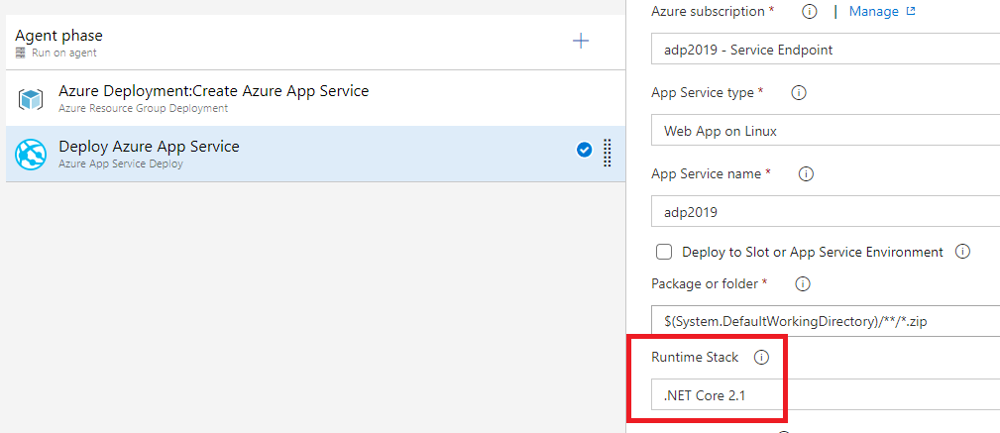

# Avanade DevOps HOL - Create a CI/CD pipeline for .NET with the Azure DevOps Project

In this lab, we setup our DevOps Project in Azure to create our CI/CD pipeline. This will provide us with a standard code base to work with.

Based on [this](https://docs.microsoft.com/en-us/azure/devops-project/azure-devops-project-aspnet-core) tutorial.

## Prerequisites

- Complete the [Prerequisites](prerequisites.md) lab.

## Tasks

1. Go to your Azure Portal and create a new DevOps Project. Make sure it meets the following demands:
    - .NET Runtime
    - ASP.NET Core application
    - Linux Web App
    - Linked to your existing Azure DevOps account

1. When the azure resources are created, go to your Azure DevOps account and make sure that:
   - The first Build and Release are successful
   - The App is deployed and accessable

1. Clone your code repository to your development environment and open your solution in Visual Studio:
   - Upgrade all projects to ASP.NET Core 2.1 (Right-click project > Properties)
   - Update all NuGet packages to their 2.x counterparts (Right-click project > Manage NuGet packages > Select all packages > Update)
   - Add NuGet package to the web project: "Microsoft.NET.Sdk.Razor"

1. Add the following NuGet packages to the **FunctionalTests** project:
   - Selenium.Support
   - Selenium.WebDriver
   - Selenium.Chrome.WebDriver

1. We need to ensure that the Selenium Chrome driver executable will be copied to the output during publishing. Edit your **FunctionalTests** project file and add the following:
    ```xml
    <PropertyGroup>
        <PublishChromeDriver>true</PublishChromeDriver>
    </PropertyGroup>
    ```

1. Unload the web project and unit test project. Make the following change to both project files:
   - Remove the line
    ```xml
    <PackageTargetFallback>$(PackageTargetFallback);portable-net45+win8+wp8+wpa81;</PackageTargetFallback>
    ``` 

1. Reload all the projects, build your solution and run the unit tests. Make sure that the tests pass

1. Open the folder "ArmTemplates" in your source, and edit the file "linux-webapp-template.json":
    - Change the dotnetcore version to 2.1:
    ```json
    "linuxFxVersion": {
        "type": "string",
        "defaultValue": "dotnetcore|2.1"
    },
    ```

1. Go to your Azure Devops project site and edit the Release definition
    - In the step "Deploy Azure App Service" change the Runtime Stack to .NET Core 2.1
    

1. Push your code to trigger a build/release

1. When the Release is finished, visit your web app url to verify it is still working

## Stretch goals

1. Add custom logging to Application Insights through your Web App

## Next steps
Return to [the lab index](../README.md) and continue with the next lab.