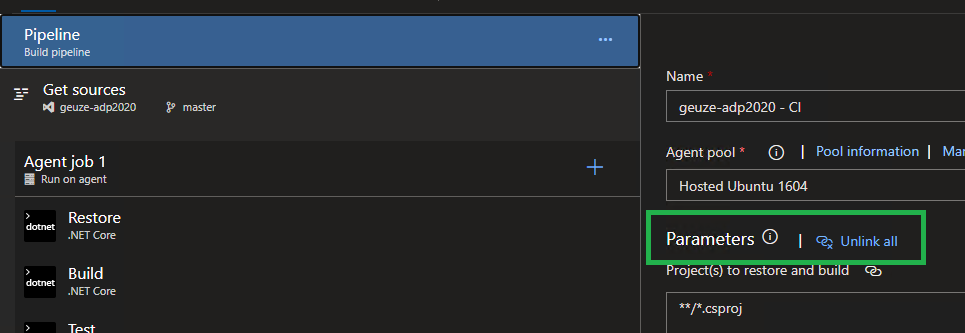

# Continuous Integration with Azure DevOps

In this lab, we setup our DevOps Project in Azure to create our CI/CD pipeline. This will provide us with a standard code base to work with. We will also generate a YAML file from the existing pipeline, so we can work with Pipeline as Code in future labs. We will use the existing Build steps as a template and expand the coded pipeline with a Deploy stage.

Based on the following tutorials:
- [Azure Devops Project ASP.NET Core](https://docs.microsoft.com/en-us/azure/devops-project/azure-devops-project-aspnet-core)
- [Adding Continuous Delivery to the YAML definition](https://www.azuredevopslabs.com/labs/azuredevops/yaml/#task-4-adding-continuous-delivery-to-the-yaml-definition)

## Prerequisites

- Complete the [Prerequisites](prerequisites.md) lab.

## Tasks

### Setting up the code repository on your development machine

1. Go to your Azure Portal and create a new DevOps Project. Make sure it meets the following demands:
    - .NET Runtime
    - ASP.NET Core application
    - Linux Web App
    - Linked to your existing Azure DevOps account

1. When the azure resources are created, go to your Azure DevOps account and make sure that:
   - The first Build and Release are successful
   - The App is deployed and accessable through the web app url (*.azurewebsites.net)

1. Clone your code repository to your development environment using:
   - `git clone <url.to.your.project>`

### Set up the Pipeline as Code

1. In the root folder of your repository, create a new file called `azure-pipelines.yaml`

1. In your browser, go to Azure DevOps Pipelines and Edit the existing pipeline:
   - Unlink the parameters:
     

   - Go to Triggers and disable continuous integration:
     

   - Save the pipeline changes, do not queue

   - Select the Agent Job and click 'View YAML':
     

   - Select all text from the YAML view and copy it

1. Paste all the contents into your `azure-pipelines.yaml` file

1. Save all changes and commit + push them to your repository

### Set up a pipeline in Azure Devops using the YAML file

1. Go to Azure DevOps Pipelines and click 'New Pipeline'

1. Create the new pipeline with the following settings:
    - Azure Repos Git (YAML)
    - Choose your git repository
    - Existing Azure Pipelines YAML file
    - Choose the YAML file from your repository

1. Add a new Variable:
    - Name: BuildConfiguration
    - Value: release

1. Click Run to finalize the setup and wait for the build to complete

### Add a Deploy stage to the pipeline

1. Follow the [steps from this guide](https://www.azuredevopslabs.com/labs/azuredevops/yaml/#task-4-adding-continuous-delivery-to-the-yaml-definition) to add a deployment stage to the pipeline

## Next steps
Return to [the lab index](../README.md) and continue with the next lab.