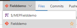

# Avanade DevOps HOL - Modern Engineering Platform Field Demo
These are the hands on labs associated with the Avanade DevOps Practitioners course.  This lab installs the Avanade Modern Engineering Platform (MEP) Field Demo as the labs for the second day of the course.

Once the installation is complete, examples of CI/CD, Telemetry, etc. can be demonstrated.

The objective of this lab is to prepare the students to be able to demonstrate the documented scenarios and be able to discuss MEP/DevOps with clients and other practioners.

# Avanade MEP Field Demo Installation
1. Go to the [Avanade InnerSource information page](https://innersource.avanade.com/Home/Asset/MEPFielddemo) and click on the green Download button to download the scripts for configuring the demo to your download location on your laptop.

1. Extract the contents of the downloaded zip file

1. Pull together the information you are going to need to configure the MEPFieldDemo
	- Configure a password for the Avanade InnerSource source repository
		- Click on the orange Access Source button on the above site. (log in with your Avanade credentials)
		- Navigate to the Git code files in the Fielddemo repository (not $/MEPFielddemo). Click on the “clone” link.</br>
		NOTE: You may need to switch from the TFS repository to the Git repository by clicking on the dropdown in the upper 
		left corner of the repository page.</br>
		
		- Click on the “Generate Git Credentials”.  
		- Fill out the password fields (this is a new password you make up for InnerSource Git, not your Avanade password)
		- Click “Save Git Credentials” (your done now, don’t actually clone the repository)
		- Remember the password this is your <InnerSource Git Password> for later.
	- Create a PAT (private access token)
		- Log into your VSTS account (your personal VSTS, not InnerSource VSTS)
		- On the upper right hand part of the screen under the username/icon, select “Security” from the drop down menu
		- Under personal access tokens, choose Add to create a new token. Name the token something like MEPFieldDemo.  Choose a expiration time that makes sense.  Make sure the All Scope radio button is selected.  Copy the generated token and save away for use later as the <VSTS Private Access token>.
		- Run PowerShell as an admin
		- Run the Get-Module command to make sure Azure and AzureRM modules are installed.  If not use the commands below.
			```PowerShell
            Install-Module Azure -scope CurrentUser
			Install-Module AzureRM -scope CurrentUser
			Import-Module Azure 
			Import-Module AzureRM
            ```
1.	Navigate to the extracted folder
	- cd C:\Users\\<your-user-id\>\Downloads\Configure-MEPVSTSDemo
1.	Run the PowerShell script to start the deployment configuration
	- .\Start-Deployment.ps1
		- Target VSTS account name: (this is just the first part of the VSTS account you’ve been using in the class; i.e. not the .visualstudio.com part)
		- Target project name: This is the name of a new project that will be created in VSTS.  Name it something like “MEPFieldDemo” or “customerdemo”.
		- UserName: This is the username you use to connect to VSTS; either your Microsoft email or Avanade email, whichever you use for the VSTS you’ve been using in the class.
		- VSTS Private Access token:  This is the <VSTS Private Access token> you created and saved earlier.
		- Source repository id: This is your Avanade email
		- Source repository dedicated password: This is the <InnerSource Git Password> you created earlier
		- Set up a Lite FieldDemo: Y will configure a light version of the demo, N will ask more questions.
			- If you choose Y for Lite FieldDemo, you’ll be prompted for your Azure credentials. Type in credentials and skip to step viii below. 
			- If you choose N to Lit FieldDemo you’ll be prompted for a couple of additional options for additional features such as containers and mobile.  In order to do mobile, you’ll need a mobile Private Access Token (left as an exercise for the reader 😊)
		- The next prompt will ask for the target Azure subscription.  Use the one you’ve been using for the class if you have more than one.
		- Globally unique name: Pick a unique name for the demo website; something like billpayui\<your name\> (no spaces or special characters unless you want a challenge)
		- Passphrase/key: A new password you make up.  Remember this, you might need it later 😊.
		- The deployment will start.  If there are errors, look at the error output and see what might have gone wrong (there should be no errors, debugging the errors is not part of the exercise).  If there are errors, it seems that just re-running the installation seems to allow the installation to complete the second or third time through (no idea yet why this is but it seems to work).  First try to figure out the error looking at the output but if it isn't pretty obvious what the problem is, try running the configuration again.
		- When the deployment script completes without error, log into VSTS account and look at the Build and watch the builds complete (investigate what these builds are doing – this is the DevOps stuff).  When the builds complete, take a look at the Releases (investigate these)
	- This build/release process can take 45 min to an hour.
	- Once the releases are done, log into the Azure portal and investigate the resources that have been deployed.

>**Note:** When you are done with the class, you will probably want to either turn off (or just delete) the resources created in Azure to keep your Azure subscription from running out of funds.  You can re-run this process to re-install the environment when needed.

# Practice the Scenarios
Navigate to VSTS account and review the new project that has been created.
		- Navigate to the website that was created e.g. billpayui\<your name\>.trafficmanager.net

**Look at the documentation links at the bottom of the project readme and work through the provided scenarios.**
