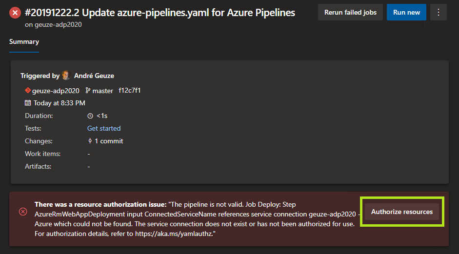

# Avanade DevOps HOL - Add Staging environment and define your multi-stage continuous deployment process with approvals and gates

In this lab, we introduce a Staging environment and setup our multi-stage continuous deployment process by adding approvals and gates.

Based on the following tutorials and VERY useful pages:
- [Set up staging environments in Azure App Service](https://docs.microsoft.com/en-us/azure/app-service/deploy-staging-slots)
- [Deployment Jobs](https://docs.microsoft.com/en-us/azure/devops/pipelines/process/deployment-jobs?view=azure-devops)
- [Approvals and checks](https://docs.microsoft.com/en-us/azure/devops/pipelines/process/approvals?view=azure-devops&tabs=check-pass)
- [Pipeline Variables](https://docs.microsoft.com/en-us/azure/devops/pipelines/build/variables?view=azure-devops&tabs=yaml#pipeline-variables)

## Prerequisites

- Complete lab [Continuous Integration with Azure DevOps](../azure-devops-project/README.md).

## Tasks

### Add the Staging environment in the Azure App Service

1. Read the guide on [setting up staging environments in Azure App Service](https://docs.microsoft.com/en-us/azure/app-service/deploy-staging-slots)

1. Add a Staging Deployment Slot to your App Service in Azure

### Add a Deployment stage to the pipeline

1. Follow the [steps from this guide](https://www.azuredevopslabs.com/labs/azuredevops/yaml/#task-4-adding-continuous-delivery-to-the-yaml-definition) to convert your pipeline to use stages. Create your first stage `Build` and then continue with the next step below

1. Add the following stage to the bottom of your pipeline:
   ```
   - stage: DeployStaging
     displayName: Deploy to Staging
     jobs:
     - deployment: DeployStaging
       displayName: Deploy to Staging
       environment: Staging
       strategy:
         runOnce:
           deploy:
             steps:
             - task: AzureRmWebAppDeployment@4
               inputs:
                 ConnectionType: 'AzureRM'
                 azureSubscription: 'geuze-adp2020 - Azure'
                 appType: 'webAppLinux'
                 WebAppName: 'geuze-adp2020'
                 deployToSlotOrASE: true
                 ResourceGroupName: 'geuze-adp2020-rg'
                 SlotName: 'staging'
                 packageForLinux: '$(Pipeline.Workspace)/drop/*.zip'
   ```

1. Make sure to configure the `AzureRmWebAppDeployment` task to use your own subscription, app name and resource group name

1. Finally save and run the pipeline. If you encounter an authorization issue on your first next run, click the Authorize button and then try again:
     

### Add a second Deployment stage for Production

1. Add another stage to the bottom of your pipeline, but this time name it Production:
   ```
   - stage: DeployProduction
     displayName: Deploy to Production
     dependsOn: DeployStaging
     jobs:
       - deployment: DeployProduction
         displayName: Deploy to Production
         environment: Production
         strategy:
           runOnce:
             deploy:
               steps:
               - task: AzureRmWebAppDeployment@4
                 inputs:
                   ConnectionType: 'AzureRM'
                   azureSubscription: 'geuze-adp2020 - Azure'
                   appType: 'webAppLinux'
                   WebAppName: 'geuze-adp2020'
                   deployToSlotOrASE: true
                   ResourceGroupName: 'geuze-adp2020-rg'
                   SlotName: 'production'
                   packageForLinux: '$(Pipeline.Workspace)/drop/*.zip'
   ```

1. Make sure to configure the `AzureRmWebAppDeployment` task to use your own subscription, app name and resource group name for Production

1. Save and run the pipeline again. Verify the pipeline runs through all the stages and ends with a successful Production deployment

### Add the approval check to the Production Environment

1. Follow the steps from [Approvals and checks](https://docs.microsoft.com/en-us/azure/devops/pipelines/process/approvals?view=azure-devops&tabs=check-pass) to add a check to the Production environment

1. Once saved, run the pipeline again and watch the progress

1. If Staging is deployed succesfully, make sure that the web app is running by visiting the website at \<yourappservice\>-staging.azurewebsites.net

1. Go to the pipeline run and click the Review button. Now click Approve to satisfy the check. This will allow the pipeline to continue with the Production Stage

1. Now check the Production web app at \<yourappservice\>.azurewebsites.net and verify that it is running

## Next steps
Return to [the lab index](../README.md) and continue with the next lab.