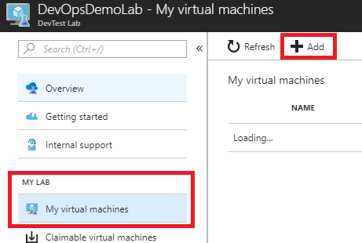
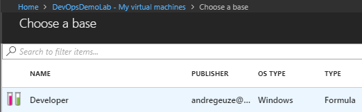

# Avanade DevOps HOL - Prerequisites

In this lab, we will be setting up your lab environment by using DevTestLabs on Azure.

## Prerequisites

1. An active Azure subscription on a personal AD (Not the Avanade AD).
   - Visit the [Azure Portal](https://portal.azure.com)

1. An active Visual Studio Team Services account.
   - [Sign up for Visual Studio Team Services](https://www.visualstudio.com/en-us/docs/setup-admin/team-services/sign-up-for-visual-studio-team-services)

1. Install [Azure PowerShell](https://docs.microsoft.com/nl-nl/powershell/azure/install-azurerm-ps) on your local machine

## Set up your environment with Azure DevTestLabs

1. Download the [devtestlabs demo](./demos/devtestlabs) directory or clone this entire repository to your local filesystem with Git.

1. Run Windows PowerShell ISE as an administrator and open [ProvisionDemoLab.ps1](./demos/devtestlabs/ProvisionDemoLab.ps1).

1. Edit the ResourceGroup variables in the top of this script to your personal preference. Make sure the subscription name is the name of an actual subscription on your Azure account:
    ```PowerShell
    $ResourceGroupName = "rg-ADP2018"
    $ResourceGroupLocation = "West Europe"
    $subscriptionName = "Visual Studio Enterprise"
    ```

1. Run the script (F5) to start deploying this template to Azure. Wait for the operation to complete before closing the PowerShell ISE.

1. Go to [your Azure Portal](https://portal.azure.com) and open your DevTestLab.

1. Go to "My virtual machines" to add a new VM to your lab.
    

1. Choose the formula that was created as part of your Lab (Developer) as base.
    

1. Enter a name for your Virtual Machine and click "Create" to begin creating the VM.

1. After this step, your VM has been created.