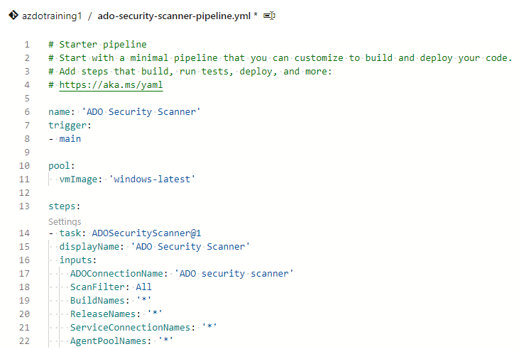

# Secure DevOps Kit for Azure (ADO Scanner)

This instructions are based on the following documentation: 
- [Running ADOScanner as pipeline extension](https://github.com/azsk/ADOScanner-docs/tree/master/05-Running%20ADOScanner%20as%20pipeline%20extension)


## Azure DevOps (ADO) security scanner

The ADO security scanner helps you to keep your ADO environment configured securely. You can run the ADO security scanner in 3 modes:
1. Standalone in a PowerShell console.
1. ADO pipeline via a marketplace extension.
1. Azure-based containerized automated scanning solution.

In this lab we will configure option 2: ADO pipeline via a marketplace extension.

## Prerequisites
- Have an ADO environment with "Project Collection Administrator" or "Owner" permission.

## Install ADO security scanner extension
1. Go to https://marketplace.visualstudio.com/items?itemName=azsdktm.ADOSecurityScanner
1. Press on `Get it free`
1. Select your ADO organisation
1. Press `Install`
1. Press `Proceed to organization`, this will take you back to your ADO environment. Which will now have the extension installed.

## Create Personal Access Token
To be able to run the ADO security scanner, the pipeline needs a Service Connection with the right access rights. To setup the Service Connection we need a Personal Access Token (PAT)
1. Go to your Personal Access Tokens

    

    

1. In the Personal Access Tokens view, press `New Token`, this will open a new window where you specify the settings of the new PAT.
    
1. Fill in the following details:

    - **Name:** ADO scanner Token
    - **Organization:** Select your ADO organization.
    - **Expiration (UTC):** custom defined, select an period that will cover this training at least. Or you can select a default value.
    - **Scopes:** `Custom defined`, `Show more scopes` and then make sure the following things are enabled:

    | Scope     | Privilege |
    | :--------- | :------------------------|
    | Agent Pools | Read |
    | Auditing | Read Audit Log |
    | Build | Read |
    | Entitlements | Read |
    | Extension Data | Read & write |
    | Extensions | Read |
    | Graph | Read |
    | Identity | Read |
    | Member Entitlement Management | Read |
    | Project and Team | Read |
    | Release | Read |
    | Secure Files | Read |
    | Service Connections | Read |
    | Task Groups | Read |
    | Tokens | Read & manage |
    | User Profile | Read |
    | Variable Groups | Read |
    | Work Items | Read & write |

1. Click on Create
1. Copy token value and store it some where save (for example notepad). You can't access this after you close the window. If you forgot it you need to recreate the token with all the settings.

## Create Service Connection
1. Go to `Project settings`
1. Then below `Pipelines` click on `Service connections`
1. Click on `New service connection`
1. Choose `Azure Repos/Team Foundation Server`
1. Fill in the following details:
    - **Authentication method:** Url of your ADO environment
    - **Connection URL:** ADO Scanner
    - **Personal Access Token:** Paste the PAT you just have created
    - Press verify, this should be successfull
    - **Service connection name:** ADO security scanner
    - **Grant access permission to all pipelines:** This should be enabled
1. Click on `Verify and save` and the Service Connection is being created

## Create ADO security scanner pipeline
1. Create a new build pipeline in ADO by going to `Pipelines` --> `Pipelines` and click on `New pipeline`.
1. Click on Azure Repos Git, select azdotraining1
1. Select `Starter pipeline`, this will open a yaml file.
1. Change name of the yaml file to `ado-security-scanner-pipeline.yml` by pressing on `azure-pipelines.yml`
1. In the yaml file remove both the script steps.
1. Above trigger add the next piece of code (please make sure that identation is correct)
    ```YAML
    name: 'ADO Security Scanner'
    ```
1. Change the vmImage towards `windows-latest`.
1. Add the `ADOSecurityScanner@1` task with the following code (please make sure that identation is correct):
    ```YAML
    steps:
    - task: ADOSecurityScanner@1
      displayName: 'ADO Security Scanner'
      inputs:
        ADOConnectionName: 'ADO security scanner'
        ScanFilter: All
        BuildNames: '*'
        ReleaseNames: '*'
        ServiceConnectionNames: '*'
        AgentPoolNames: '*'
    ```
1. The end result should look like this:
    

1. Click on `Save and run`, and click on `Save and run` once again. The pipeline will be created and it will automatically start.

1. Wait till the pipeline is succesfully finished. 

The pipeline will be created and you will get an authorization issue. Click on 'Resources authorized'.

## Visualize security scan results
After the scan is completed, the results aren't visible yet. To visualize the results we need to create a project dashboard.

The ADO security scanner extension contains two widgets which can be placed on an ADO dashboard:

1. **Org Level Security Scan Summary:** Displays org level security control evaluation summary. This Dashboards helps org owners to take actions based on control failures.

1. **Project Component Security Scan Summary:** Displays project components (Build/Release/Connections) security control evaluation summary.

To implement these widgets follow the following steps:
1. Inside ADO go to `Overview`, `Dashboards`
1. On this page click on `Add a widget`, this will open a new view with a grid.
1. This grid represents your dashboard and on the right side you see all the widget you can add.
1. First add `ADO Security Org Security View` widget.
1. Then add `ADO Security Project Component` widget.
1. Click on `Done Editing` to save your dashboard.