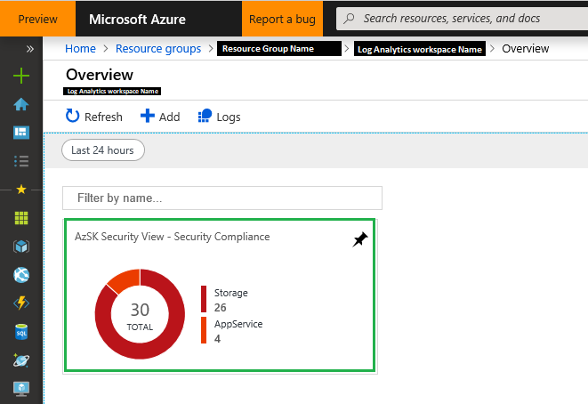

# Secure DevOps Kit for Azure

This lab contains instructions to explore the possibilities of the Micorosoft Secure DevOps kit. This kit contains several tools to scan and monitor security in Azure in the following categories:
- Subscription Security
- Secure Development
- Security in CICD
- Continuous Assurance
- Alerting & Monitoring
- Cloud Risk Governance

This instructions are based on the following documentation
- [Getting started with the Secure DevOps Kit for Azure!](https://azsk.azurewebsites.net/00b-Getting-Started/Readme.html)

## Prerequisites
- PowerShell installed on local machine
- Active Azure subscription

## Preparations
1. Install Azure CLI on your local machine
    1. Open PowerShell prompt
    1. Execute the command: `Invoke-WebRequest -Uri https://aka.ms/installazurecliwindows -OutFile .\AzureCLI.msi; Start-Process msiexec.exe -Wait -ArgumentList '/I AzureCLI.msi /quiet'` this will install the Azure CLI on your local machine

1. Make sure you have the right PowerShell version
    - The Secure DevOps Kit requires PowerShell version 5.0 or higher
    - You can easily check the current installed PowerShell version by executing the following command in Powershell: `$PSVersionTable`
    - If your PowerShell version is not 5.0 or higher, please make sure that your PowerShell will be updated to 5.0 or higher

1. Install Secure DevOps Kit on your local machine
    1. Open PowerShell prompt and execute the command: `Install-Module AzSK -Scope CurrentUser`
    1. When the installation is finished you can easily check if the Secure DevOps Kit is correctly installed by executing the command: `azsk`. If the Secure DevOps Kit is correctly installed it will show all available commands.


## Run the Subscription Security Report (Subscription Security)
The Subscription Security Report will scan your Azure subscription on security issues.

1. Open a PowerShell prompt
1. The PowerShell prompt must be connected to your Azure environment before you can run the report. To connect the prompt with Azure execute the command: `Add-AzureAccount`. 
1. For running the Subscription Security Report you must known your subscription id. By executing the command: `Get-AzureSubscription` you can view your subscription details.
1. Now run the Subscription Security Report with the command: `Get-AzSKSubscriptionSecurityStatus -SubscriptionId <your subscription id>`
1. After the scan is completed a new file explorer will open with the scan results. Open the .csv file and examine the scan results.

## Run Azure Services Security Report (Subscription Security / Secure Development)
The Azure Services Security Report will scan your Azure resources on security issues.

1. Open a PowerShell prompt
1. The PowerShell prompt must be connected to your Azure environment before you can run the report. To connect the prompt with Azure execute the command: `Add-AzureAccount`. 
1. For running the Azure Services Security Report you must known your subscription id. By executing the command: `Get-AzureSubscription` you can view your subscription details.
1. Now run the Subscription Security Report with the command: `Get-AzSKAzureServicesSecurityStatus -SubscriptionId <your subscription id>`
1. After the scan is completed a new file explorer will open with the scan results. Open the .csv file and examine the scan results.

## Setup a Log Analytics workspace (Alerting & Monitoring)
A Log Analytics workspace is an Azure resource which can be used to easily anlyze all the Secure DevOps Kit events.

1. Using the [Azure Portal](https://portal.azure.com) to create a new Log Analytics workspace.
1. Open a PowerShell prompt and make sure that the prompt is connected with Azure
1. Connect your local machine to the Log Analytics workspace by execute the command: `Set-AzSKMonitoringSettings -WorkspaceID <your workspace id> -SharedKey <your shared key>`. The workspaceID and SharedKey can be found in Azure at your Log Analytics workspace -> Advanced settings -> Connected Sources -> Windows Servers.
1. Now generate a new event by execute the command: `Get-AzSKAzureServicesSecurityStatus -SubscriptionId <your subscription id>`
1. Go back to the [Azure Portal](https://portal.azure.com) and your Log Analytics workspace. There go to Search and execute the search query: `search * | where type == "AzSK_CL"`. This will show your recently generated event and all the other events as well.

## Deploy the AzSK Monitoring Solution (Alerting & Monitoring)
The AzSK Monitoring Solution is deployed to a Log Analytics workspace that is used by the dev ops team for monitoring and generating a dashboard for security monitoring and alerting based on AzSK control evaluation events.

1. Get the details of your Log Analytics workspace
    1. Switch to the Log Analytics subscription by using the PowerShell command `Set-AzContext -SubscriptionId <your subscription id>`
    1. Get info about the Log Analytics workspace by using the PowerShell command `Get-AzOperationalInsightsWorkspace`

1. Obtain the workspaceId and sharedKey for the Log Analytics workspace you'd like to use for monitoring. Go to the Log Analytics workspace and navigate to "Advanced Settings -> Connected Sources -> Windows Servers".

1. In the PowerShell script here below replace the variables between '<>'. After replacing the variables execute the PowerShell script to deploy the AzSK Monitoring Solution 
    ```PowerShell 
    $lawsSubId ='<Log Analytics subscription id>'   #subscription hosting the Log Analytics workspace
	$lawsId ='<Log Analytics workspace id>'
	$lawsRGName ='<Log Analytics workspace resource group name>'     #RG where the Log Analytics workspace is hosted (See 1-a)
	$azSkViewName = '<unique_name_for_your_AzSK_view>' #This will identify the tile for AzSK view in Log Analytics workspace. E.g., MyApp-View-1
			
	#This command will deploy the AzSK view in the Log Analytics workspace. Happy monitoring!  
	Install-AzSKMonitoringSolution -LAWSSubscriptionId $lawsSubId -LAWSResourceGroup -$lawsRGName -WorkspaceId $lawsId -ViewName $azSkViewName
    ```
1. In the [Azure Portal](https://portal.azure.com) go to your Log Analytics workspace to view the logs. Inside the Log Analytics workspace go to the overview page. In the Get started with Log Analytics block you can click on the View Solutions link (located below 2. Configure monitoring solutions). A new blade will something like here below. When you click on the graph it will open the Az SK Security View.



1. The next step should be analyzing the logs and create alerts based on the results of the logs. But that is out of scope for this lab.

## Setup and configure Continuous Assurance (Continuous Assurance)
1. To setup the Continuous Assurance you need to run the PowerShell command 

    ```PowerShell			
    Install-AzSKContinuousAssurance -SubscriptionId <SubscriptionId> -ResourceGroupNames ‘rgName1, rgName2,…etc.’ -LAWSId <WorkspaceId> -LAWSSharedKey <SharedKey>

    # You can also use “*” for the variable ResourceGroupNames to specify all Resource Groups
    ```

1. Verify if Continuous Assurance has been correctly setup
    1. In the [Azure Portal](https://portal.azure.com) select your subscription and search for Automation Account. You should see an Automation Account with the name `AzSKContinuousAssurance`. Click this Automation Account to go to the resouce blade.

    1. Inside the blade click on Runbooks and it should contain the runbook `Continuous_Assurance_Runbook`

    1. Inside the blade click on Schedules and it should contain the schedule `CA_Scan_Schedule`

    1. Inside the blade click on Run As Accounts and it should contain an account for the `AzSK_CA`

1. Verify that all required modules are downloaded successfully (this can take a couple hours before it is completed)
    1. Inside the blade click on the Modules tile. The module `AzSK` should be listed there. Status column value for all modules should be `Available`

1. Once the Continuous setupd and modules download are completed successfully, the runbooks will automatically execute periodically (once a day) and scan the subscription and the specified resource groups for the application(s) for security issues. The outcomes of these scans will get stored in a storage account created by the installation (format : azsk<YYYYMMDDHHMMSS> e.g. azsk20170505181008) and follows a similar structure as followed by standalone SVT execution (CSV file, LOG file, etc.).

## Setup and configure Control Telemetry (Cloud Risk Governance)
Soon Control Telemetry will be renamed towards Org Telemetry.

1. Create an Application Insights account in the [Azure Portal](https://portal.azure.com)

1. When the Application Insights account has been created execute the next PowerShell command to configure the Org Telemetry setup on your local machine `Set-AzSKLocalAIOrgTelemetrySettings -LocalAIOrgTelemetryKey '<instrumentation-key>' -EnableLocalAIOrgTelemetry $true`. Instrumentation key can be found on the overview page of the Application Insights account in the [Azure Portal](https://portal.azure.com).

1. Check the data in Application Insights account in the [Azure Portal](https://portal.azure.com). It can take around 4 to 5 minutes before the data will be shown in Azure.
