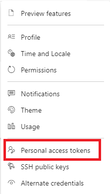
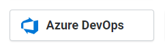
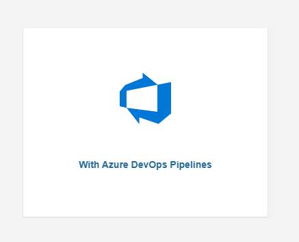

# Static code analysis with SonarCloud

This lab contains instructions to enable automated code analysis using SonarCloud.

## Prerequisites

- Complete lab: [Pipeline as code with K8s and Terraform](https://dev.azure.com/thx1139/_git/workshop1?path=%2FREADME.md)

## Create Personal Access Token
SonarCloud need to have access towards the Azure DevOps environment to be able to analyze your code. This can be arranged by a Personal Access Token (PAT). Follow this steps to create a PAT for Sonarloud.

1. Go to your Personal Access Tokens

    

    

1. In the Personal Access Tokens view, press `New Token`, this will open a new window where you specify the settings of the new PAT.
    
1. Fill in the following details:

    - **Name:** SonarCloud
    - **Organization:** Select your ADO organization.
    - **Expiration (UTC):** custom defined, select an period that will cover this training at least. Or you can select a default value.
    - **Scopes:** `Custom defined`, `Show more scopes` and then make sure the following things are enabled:

    | Scope     | Privilege |
    | :--------- | :------------------------|
    | Code | Read & Write |

1. Click on Create
1. Copy token value and store it some where save (for example notepad). You can't access this after you close the window. If you forgot it you need to recreate the token with all the settings.

## Configure SonarCloud
1. Go to [SonarCloud](https://sonarcloud.io/)
1. Select Azure DevOps:

    

1. Login with your Azure DevOps credentials
1. Allow SonarCloud to have access to your Azure DevOps environment
1. Press ```import projects from Azure```
1. Fill in the details that are being asked and press ```continue```
1. Select ```free plan``` and press ```create organization```
1. Select the repository ```azdotraining1/azdotraining1``` and press ```Setup```
1. On the page that will open click on ```With Azure DevOps```:

    

1. Install the SonarCloud extension. Be aware to choose the correct Azure DevOps organisation for the installation of the SonarCloud extension.

1. At ```Configure Azure Pipeline``` choose for ```.NET```
1. Follow the instructions for a new Service Point. You will use the SonarCloud PAT which you have made earlier in this lab.
1. Make sure you store following values on a save place, you need those values to configure the pipeline tasks:
    - SonarCloud organization
    - Project key
    - Project name

## Implement SonarCloud in the App pipeline
The last thing you need to do is add the SonarCloud tasks to the ```App pipeline```, so SonarCloud can analyze the code.

1. In the ```App pipeline``` add a new job *Run_SonarCloud_analysis* as first job in the Build stage with the following steps:
    1. Job pool vmImage = *windows-latest*

    1. Restore the solution with .NET Core
    
    1.  Prepare Analysis Configuration (SonarCloud)
        * Use the values of the previous chapter for the endpoint, project key and project name
        * Integrate with MSBuild
        * Project version: 1.0

    1. .NET Core
        * Command: build
        * Projects: **/*.sln

    1. Run Code Analysis (SonarCloud)

    1. Publish Quality Gate Result (SonarCloud)
        * Timeout (s): 300

1. Save the changes you have made.

## Run SonarCloud analysis and watch the results
1. Run the ```App pipeline```
1. When the pipeline is successfully finished, navigate towards Extensions. Here you will find the SonarCloud Analysis Report. Click on the SonarCloud link and you will be navigated to the report within SonarCloud.

1. Navigate through the report/dashboard and check what kind of information you can find her. Tip: click on a category to see more details.

1. Try to solve one of the problems and rerun the ```App pipeline``` with the latest code.

## Stretch goals

1. Install 'SonarLint for Visual Studio 2019' via 'Extensions'
2. Try to add a new Unit Test project to your solution with at least one working unit test. So you can also analyze your unit test code coverage.
    - In the ```App pipeline``` add the following step after .NET Core build step:
    ```yaml
    - Task: DotNetCoreCLI@2
      displayName: 'Execute Unit tests'
      inputs:
        command: 'test'
        projects: '**/*.csproj'
        arguments: '--collect "Code Coverage"'
    ```

## Next steps
Return to the [Lab index](../README.md) and continue with the next lab